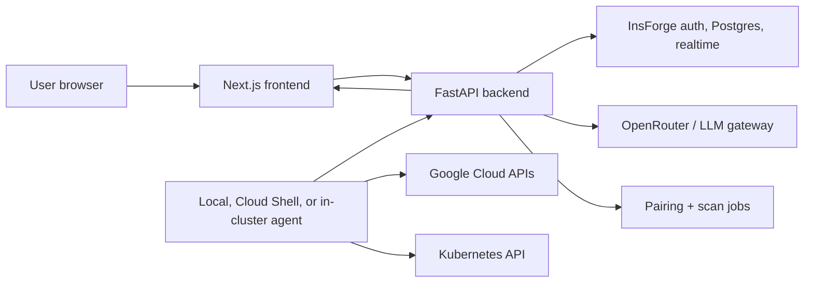

# CloudOps Console

CloudOps Console is an authenticated operations workspace for developers, DevOps teams, platform engineers, and FinOps practitioners. It brings Kubernetes troubleshooting, vulnerability scanning, and AI-assisted cloud cost analysis into one web application.

The project started as a Kubernetes assistant and has grown into a broader cloud operations console. Kubernetes remains one of the core tools, but the product is intentionally cloud- and infrastructure-focused rather than Kubernetes-only.

## What it does

- **Kubernetes troubleshooting**: scans cluster state, events, pods, deployments, services, logs, and related signals, then produces an AI-assisted diagnosis.
- **Kubernetes vulnerability scanning**: scans cluster components, workload images, Kubernetes configuration, pod/workload risk, and potential secret exposure.
- **Cloud cost analysis**: connects to cloud accounts through a local/Cloud Shell agent, scans resources, and asks an LLM to identify waste, pricing problems, and optimization opportunities.
- **Actionable remediation**: returns clear explanations and reviewable CLI commands. The app recommends commands; it does not execute destructive fixes.
- **History**: stores prior troubleshooting runs and cost analyses per authenticated user.
- **Live progress**: streams analysis progress to the frontend through WebSockets/realtime updates.
- **Credential-safe public usage**: public users connect their cloud or cluster environment through outbound agents instead of uploading kubeconfigs, OAuth tokens, or cloud keys to the hosted app.

## Live app

Production frontend:

<https://cloudops-console-jatojay.onrender.com>

Production API:

<https://cloudops-console-api-jatojay.onrender.com>

Render may cold-start free services, so the first request can take a moment.

## Core product areas

### 1. Landing page

The landing page presents the two main workflows:

- **Cost Analyzer**
- **Kubernetes Troubleshooter**

Authenticated users can move between the tools through a shared app shell. Connection setup is intentionally kept inside each tool page so users connect the exact thing they are about to scan.

### 2. Cost Analyzer

The Cost Analyzer currently focuses on Google Cloud as the first cloud provider implementation.

Users can:

- connect a local or Cloud Shell GCP agent;
- select an accessible Google Cloud project;
- run a resource scan;
- receive AI-powered cost findings;
- view a summary, issue list, severity, estimated savings, and suggested fix commands;
- revisit past analyses from the cost history page.

The AI analysis checks for:

- over-provisioned resources;
- unused or idle resources;
- misconfigurations;
- incorrect pricing tiers;
- optimization opportunities;
- practical remediation commands.

The backend is structured for additional providers over time. Cloud-specific scanner logic is separated from the generic analysis flow.

### 3. Kubernetes Troubleshooter

The Kubernetes workflow helps users investigate cluster issues without manually stitching together several `kubectl` commands.

It collects read-only evidence such as:

- cluster contexts;
- pods;
- deployments;
- services;
- events;
- recent logs;
- workload health;
- networking and selector clues.

It then produces:

- likely root cause;
- explanation;
- confidence score;
- suggested fix;
- reviewable `kubectl` commands;
- prevention guidance;
- investigation history.

### 4. Vulnerability scanning

The Kubernetes page also includes vulnerability scanning.

The scanner is designed for safer public use:

- on-demand scans;
- no privileged node collector pods;
- pagination for vulnerability results;
- severity display;
- workload-focused findings;
- cluster and pod risk visibility.

The backend uses Trivy-compatible scanning behavior. Docker images include the scanner dependency; local development may require installing Trivy separately.

### 5. Agent-based connections

CloudOps Console is designed for public users. That means users should not paste cloud credentials, kubeconfigs, OAuth tokens, or service account keys into the hosted app.

Instead, the project supports an **outbound agent architecture**:

- The hosted control plane creates short-lived pairing tokens.
- The user runs a local/Cloud Shell/cluster agent.
- The agent connects outbound to the hosted API.
- The hosted app queues scan jobs.
- The agent performs read-only scans in the user's environment.
- Results are sent back to the authenticated user's account.

This model keeps sensitive credentials inside the user's environment.

## Architecture



### Frontend

- Framework: **Next.js**
- Language: **TypeScript**
- Styling: **Tailwind CSS**
- Data fetching/state: **React Query**
- Auth/session: **InsForge SDK**

Primary frontend areas:

- `ai-kubernetes-agent/frontend/app`
- `ai-kubernetes-agent/frontend/components`
- `ai-kubernetes-agent/frontend/hooks`
- `ai-kubernetes-agent/frontend/services`
- `ai-kubernetes-agent/frontend/types`

### Backend

- Framework: **FastAPI**
- Language: **Python**
- AI: **OpenRouter-compatible chat completions**
- Cloud scanning: agent-assisted GCP scan flow
- Kubernetes scanning: read-only evidence collection and vulnerability scan endpoints

Primary backend areas:

- `ai-kubernetes-agent/backend/app/main.py`
- `ai-kubernetes-agent/backend/app/cloud_scanner.py`
- `ai-kubernetes-agent/backend/app/ai_analyzer.py`
- `ai-kubernetes-agent/backend/app/cloud_agent.py`
- `ai-kubernetes-agent/backend/app/cluster_agent.py`
- `ai-kubernetes-agent/backend/app/api`
- `ai-kubernetes-agent/backend/app/kubernetes`
- `ai-kubernetes-agent/backend/app/services`

### Backend-as-a-service

The project uses **InsForge** for:

- authentication;
- Postgres data storage;
- row-level security;
- realtime/progress updates;
- OpenRouter AI gateway support;
- server-side project configuration.

Configured project from `AGENTS.md`:

- Project: `SantaProjects`
- API base: `https://9nq78xqg.eu-central.insforge.app`

Secrets must remain in ignored environment files and InsForge project config. Do not hardcode or commit keys.

## Repository structure

```text
.
├── AGENTS.md
├── README.md
├── migrations/
├── render.yaml
└── ai-kubernetes-agent/
    ├── backend/
    ├── frontend/
    ├── helm/cloudops-agent/
    ├── kubernetes/test-scenarios/
    ├── docs/
    ├── prompts/
    ├── docker-compose.yml
    └── docker-compose.kubernetes.yml
```

## Data model

The project includes migrations for authenticated user-owned analysis and investigation history.

Important tables include:

### `users`

- `id`
- `email`
- `password_hash`
- `created_at`

### `analyses`

- `id`
- `user_id`
- `resource_group`
- `resources_scanned`
- `issues_found`
- `estimated_savings`
- `analysis_result`
- `status`
- `created_at`

The application also stores Kubernetes investigation history and agent/job metadata through InsForge-backed tables and RLS policies.

## API overview

Representative endpoints:

### Auth-protected cloud cost endpoints

- `GET /api/resource-groups`
- `POST /api/analyze`
- `GET /api/history`
- `WS /ws/progress/{analysis_id}`

### Kubernetes endpoints

- `GET /api/clusters`
- `POST /api/investigate`
- `POST /api/vulnerability-scan`
- `GET /api/history?operation=kubernetes`

### Agent endpoints

- cloud connector pairing and job routes;
- Kubernetes cluster-agent pairing and job routes;
- WebSocket paths for outbound agents.

Exact routes may evolve as providers are added, so check `ai-kubernetes-agent/backend/app/main.py` and `ai-kubernetes-agent/backend/app/api` for the current route list.

## Local development

### Prerequisites

- Node.js 22+
- Python 3.12+
- Docker and Docker Compose
- InsForge project access
- OpenRouter/InsForge AI configuration
- Optional for Kubernetes local mode: `kubectl`
- Optional for vulnerability scanning outside Docker: Trivy
- Optional for GCP connector development: Google Cloud CLI

### Environment files

Copy the examples:

```bash
cp ai-kubernetes-agent/backend/.env.example ai-kubernetes-agent/backend/.env
cp ai-kubernetes-agent/frontend/.env.example ai-kubernetes-agent/frontend/.env.local
```

Backend variables include:

```env
OPENROUTER_API_KEY=
OPENROUTER_MODEL=
COST_ANALYSIS_MODEL=openai/gpt-4o
INSFORGE_URL=
INSFORGE_API_KEY=
PUBLIC_API_URL=http://localhost:8000
INSFORGE_TIMEOUT_SECONDS=15
CLOUD_SCAN_TIMEOUT_SECONDS=60
GCP_PROJECT_ID=
OPENROUTER_BASE_URL=https://openrouter.ai/api/v1
OPENROUTER_TIMEOUT_SECONDS=45
OPENROUTER_MAX_RETRIES=2
OPENROUTER_MAX_TOKENS=1200
KUBECONFIG_PATH=
KUBECTL_TIMEOUT_SECONDS=30
KUBECTL_LOG_TAIL_LINES=200
CONTAINER_CREATING_TIMEOUT_SECONDS=300
VULNERABILITY_SCAN_TIMEOUT_SECONDS=600
ENVIRONMENT=development
LOG_LEVEL=INFO
CORS_ORIGINS=http://localhost:3000
```

Frontend variables include:

```env
NEXT_PUBLIC_API_BASE_URL=http://localhost:8000
NEXT_PUBLIC_INSFORGE_URL=
NEXT_PUBLIC_INSFORGE_ANON_KEY=
NEXT_PUBLIC_APP_URL=http://localhost:3000
NEXT_PUBLIC_BACKEND_WS_URL=ws://localhost:8000
```

Never commit `.env`, `.env.local`, API keys, kubeconfigs, service-account keys, or OAuth tokens.

### Run with Docker

From the app folder:

```bash
cd ai-kubernetes-agent
docker compose up --build
```

Then open:

- Frontend: <http://localhost:3000>
- Backend health: <http://localhost:8000/health>

### Run backend locally

```bash
cd ai-kubernetes-agent/backend
python -m venv .venv
source .venv/bin/activate
pip install -r requirements.txt
uvicorn app.main:app --reload --host 0.0.0.0 --port 8000
```

For development/test tools:

```bash
pip install -r requirements-dev.txt
```

### Run frontend locally

```bash
cd ai-kubernetes-agent/frontend
npm install
npm run dev
```

Open:

<http://localhost:3000>

## Connecting Google Cloud

Public users should use:

```text
Cost Analyzer → Connect cloud
```

The app generates a short-lived pairing token and a connector command. The user runs that command in an environment where they already have `gcloud` configured.

Before connecting:

```bash
gcloud auth login
gcloud services enable cloudasset.googleapis.com --project PROJECT_ID
```

The active Google identity needs read-only permissions such as:

- `roles/cloudasset.viewer`
- `roles/serviceusage.serviceUsageConsumer`

The connector lists accessible projects and executes read-only Cloud Asset Inventory scans. Google OAuth tokens and ADC credentials stay on the user's machine or Cloud Shell.

## Connecting Kubernetes

Public users should use:

```text
Kubernetes → Connect cluster
```

The app generates a short-lived pairing token and install command. The preferred public architecture is the outbound in-cluster/CLI agent.

The Kubernetes agent:

- opens outbound connections only;
- uses a dedicated ServiceAccount;
- collects read-only evidence;
- does not receive broad mutation permissions;
- does not execute AI-recommended fix commands;
- reports results back to the user's authenticated account.

For local CLI-style usage:

```bash
cd ai-kubernetes-agent/backend
python -m app.cluster_agent \
  --control-plane https://your-console.example.com \
  --token coa_REPLACE_ME \
  --cluster-name production \
  --kubeconfig "$HOME/.kube/config"
```

Helm chart:

```text
ai-kubernetes-agent/helm/cloudops-agent
```

## Direct local Kubernetes mode

For local development, you can mount a kubeconfig into the backend container:

```bash
cd ai-kubernetes-agent
HOST_KUBECONFIG_DIR="$HOME/.kube" \
  docker compose -f docker-compose.yml -f docker-compose.kubernetes.yml up --build
```

If your kubeconfig references external certificate files, create a flattened copy first:

```bash
mkdir -p .kube-docker
kubectl config view --raw --flatten > .kube-docker/config
HOST_KUBECONFIG_DIR="$PWD/.kube-docker" \
  docker compose -f docker-compose.yml -f docker-compose.kubernetes.yml up --build
```

## AI behavior

CloudOps Console uses AI for analysis and explanation, not autonomous changes.

AI output is expected to include:

- summary;
- issues found;
- severity: `high`, `medium`, or `low`;
- estimated savings for cost analysis;
- explanation;
- suggested CLI commands;
- prevention/remediation guidance.

Important safety rules:

- AI-proposed commands are shown for human review.
- The application does not execute destructive commands automatically.
- Kubernetes evidence collection is read-only.
- Cloud scans are read-only.

## Testing

### Frontend

```bash
cd ai-kubernetes-agent/frontend
npm run lint
npm run build
```

### Backend

```bash
cd ai-kubernetes-agent/backend
pytest
```

## Deployment

This repository includes `render.yaml` for Render deployments.

The current production setup uses separate Render services for:

- frontend;
- backend/API.

Render environment variables must be configured from the dashboard. Do not commit production secrets.

Common deployment notes:

- Backend start command should run Uvicorn through the installed Python environment or the provided backend entrypoint.
- Frontend must point `NEXT_PUBLIC_API_BASE_URL` at the deployed backend.
- WebSocket URL should use `wss://` in production.
- `PUBLIC_API_URL` should point to the public backend API so generated agent commands are correct.
- CORS must include the deployed frontend origin.

## Security model

CloudOps Console is designed around least privilege:

- authentication required for protected routes;
- owner-scoped history;
- InsForge row-level security;
- server-only AI and backend keys;
- short-lived pairing tokens;
- outbound agents instead of uploaded credentials;
- read-only scanning by default;
- human-reviewed remediation commands.

## Current status

Implemented:

- public signup/login;
- landing page with two product cards;
- shared authenticated navigation;
- GCP cost analyzer;
- AI-powered cost report;
- cost history;
- Kubernetes troubleshooting;
- Kubernetes vulnerability scanning;
- Kubernetes history;
- cloud connection flow;
- cluster connection flow;
- outbound agent architecture;
- Render deployment support.

Planned/possible next steps:

- additional cloud providers such as AWS and Azure;
- richer FinOps recommendations;
- team/workspace support;
- scheduled scans;
- alerting integrations;
- more Kubernetes policy/security checks;
- exportable reports.

## Contributing

This is an active project. A good contribution flow is:

1. Open an issue or describe the change.
2. Create a feature branch.
3. Run frontend and backend checks.
4. Keep credentials out of commits.
5. Submit a pull request with screenshots or API examples where helpful.

## License

No license file is currently included. Add one before treating the repository as formally open source.

